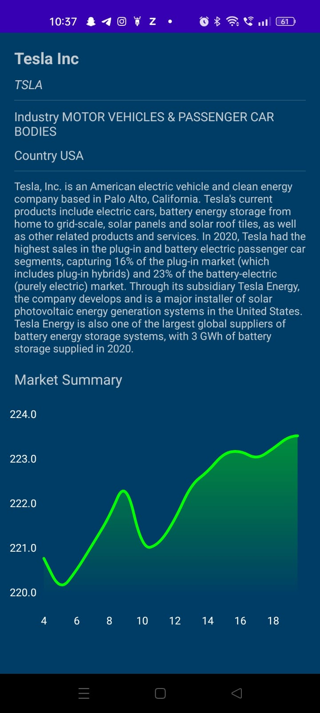
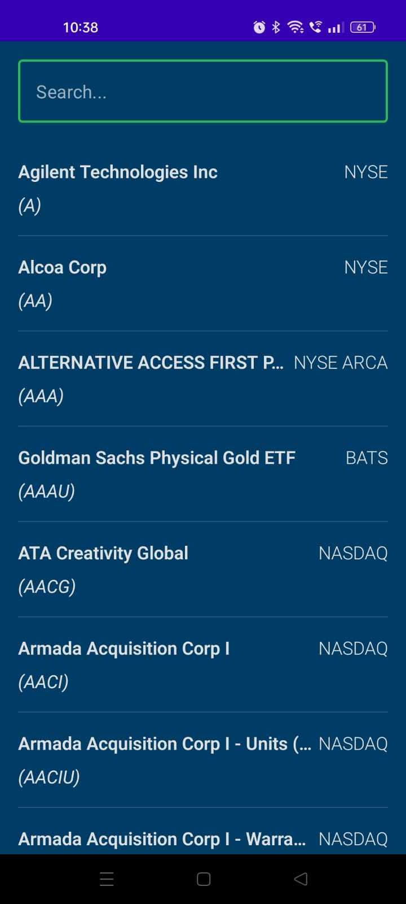

# Stock Market App

This App displays all the companies listed in stock and shows the price detail of each company in
graph.

## About the project

The project tries to combine popular Android tools and to demonstrate best development practices by
utilizing up to date tech-stack like Compose, Kotlin Flow and Dagger hilt. The sample app layers its
presentation through MVVM Clean Architecture presentation pattern.

## Screenshots






## API Reference

#### Get all listed companies

```http
GET /query?function=LISTING_STATUS
```

| Parameter | Type     | Description                |
|:----------|:---------|:---------------------------|
| `api_key` | `string` | **Required**. Your API key |

#### Get Intra day info of particular company

```http
  GET /query?function=TIME_SERIES_INTRADAY&interval=60min&datatype=csv
```

| Parameter | Type     | Description                     |
|:----------|:---------|:--------------------------------|
| `api_key` | `string` | **Required**. Your API key      |
| `symbol`  | `string` | **Required**. Symbol of company |

#### Get company info

```http
  GET /query?function=OVERVIEW"
```

| Parameter | Type     | Description                     |
|:----------|:---------|:--------------------------------|
| `api_key` | `string` | **Required**. Your API key      |
| `symbol`  | `string` | **Required**. Symbol of company |

## Architecture

## Modern Architecture

- **Single Activity Architecture**: Utilizes the Navigation component to define navigation graphs,
  promoting a more modular and manageable approach.
- **MVVM Clean Architecture**: Implements a reactive and layered architecture, enhancing scalability
  and maintainability.
- **Android Architecture Components**:
    - **ViewModel**: Manages UI-related data in a lifecycle-conscious way.
    - **Navigation**: Handles everything needed for in-app navigation.
- **Android KTX**: Jetpack Kotlin extensions that simplify the code and make it more idiomatic.

## UI Components

- **Compose**: A modern declarative UI framework used to build the interface with less code and
  powerful tools.
- **Material Design**: Adheres to Material Design principles for a cohesive and functional UI,
  ensuring a great user experience.

## Third-Party Libraries

- **OpenCSV**: A library for reading and writing CSV files.
- **Dagger - Hilt**: A dependency injection framework for Android.
- **Retrofit**: A type-safe HTTP client for Android and Java.
- **OkHttp**: A modern HTTP client for Android and Java applications.
- **Room Persistence Library**: A part of the Android Jetpack, providing an abstraction layer over
  SQLite.
- **Compose Destinations**: A navigation library for Jetpack Compose that uses a simple and
  intuitive API.
- **Accompanist**: A group of libraries that aim to supplement Jetpack Compose with features that
  are commonly required by developers but not yet available.

## Installation and Setup

To set up this project locally, follow these steps:

- Clone the repository
- Open the project in Android Studio.
- Obtain an API key from [AlphaVantage](https://www.alphavantage.co/support/#api-key) and
  replace `API_KEY` in `StockApi.kt` with your own key.
- Build and run the application.

## Usage

After launching the app, you will see a list of all listed companies. You can:

- Tap on any company to view its price details and historical data in a graph.
- Use the search functionality to quickly find a specific company.

## Contributing

Contributions are welcome! If you have suggestions or improvements, please fork the repository and
submit a pull request. For major changes, please open an issue first to discuss what you would like
to change.

## Acknowledgments

- Special thanks to Philipp Lackner for his educational content on Android development, which has
  been a great resource and inspiration for this project.
- Thanks to AlphaVantage for providing the financial data API.
- Special thanks to all the contributors of the open-source libraries used in this project.

## Contact Information

For support or queries, please email us at puviek7@gmail.com
